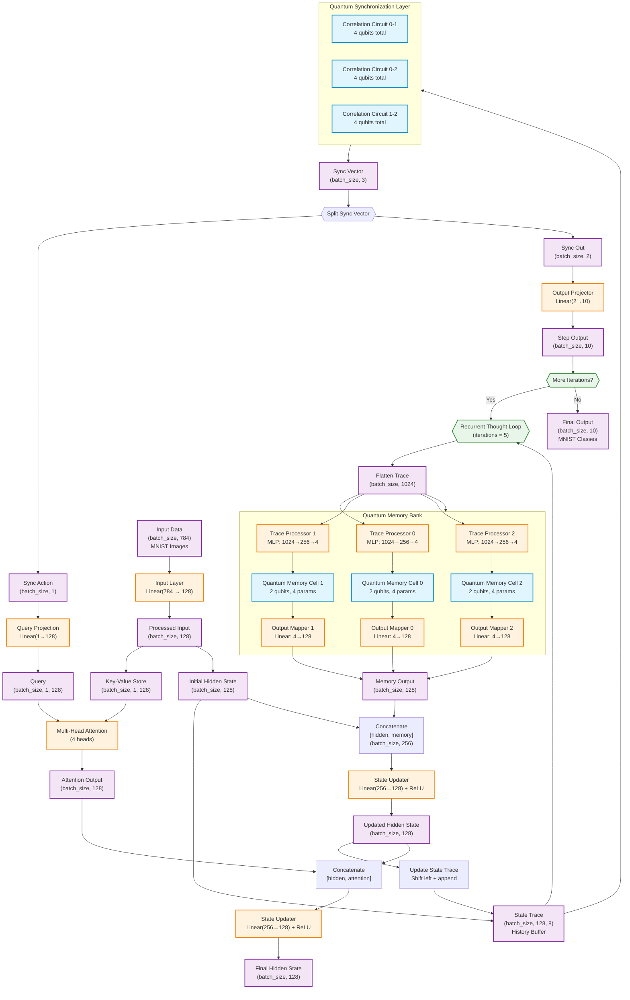

# Quantum Continuous Thought Machine (Quantum CTM) Architecture

## Overview

The Quantum CTM is a hybrid quantum-classical neural network that implements the principles of Continuous Thought Machines using quantum memory cells and quantum synchronization. The architecture allows for iterative refinement of thoughts through a recurrent processing loop.

## Architecture Diagram

## Component Descriptions

### Classical Components

1. **Input Layer**: Linear transformation from input dimension (784 for MNIST) to hidden dimension (128)
2. **Trace Processors**: MLPs that compress the state history (1024D) down to quantum-compatible parameters (4D)
3. **Output Mappers**: Linear layers that project quantum measurement probabilities back to hidden dimension
4. **State Updater**: ReLU-activated linear layer that updates the hidden state based on memory and attention outputs
5. **Attention Mechanism**: Multi-head attention (4 heads) that uses synchronization output to focus on input features
6. **Output Projector**: Final linear layer that maps synchronization output to class predictions

### Quantum Components

1. **Quantum Memory Cells**: 
   - 3 independent slots, each with 2 qubits
   - Parameterized by RY and RZ rotation gates
   - Stores compressed representations of the state history

2. **Quantum Synchronization Layer**:
   - Creates correlation circuits between memory slot pairs (0-1, 0-2, 1-2)
   - Measures entanglement/correlation between quantum states
   - Produces synchronization metrics for controlling attention and output

### Data Flow

1. **Input Processing**: MNIST images are flattened and transformed to hidden dimension
2. **Recurrent Loop**: The model iterates 5 times, refining its internal state
3. **Memory Access**: State history is compressed and stored in quantum memory
4. **Synchronization**: Quantum correlations guide attention and output generation
5. **Output Generation**: Final predictions are based on the synchronization vector

### Key Features

- **Iterative Refinement**: Multiple thought steps allow complex reasoning
- **Quantum Memory**: Exploits quantum superposition for efficient state storage
- **Quantum Correlation**: Uses entanglement to measure relationships between memory slots
- **Hybrid Processing**: Combines classical neural networks with quantum circuits
- **Attention Control**: Quantum synchronization drives classical attention mechanism

## Implementation Notes

- Built with PyTorch and Qiskit
- Uses Qiskit's `TorchConnector` for automatic differentiation through quantum circuits
- Supports batch processing for efficient training
- Modular design allows easy experimentation with different quantum architectures 